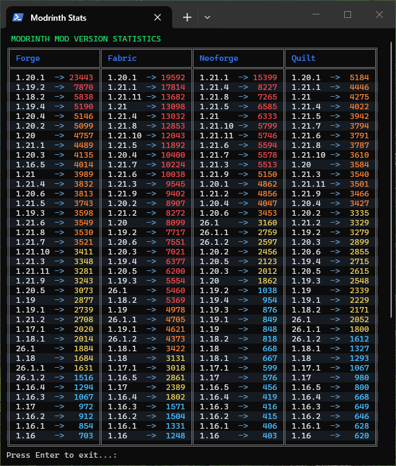

  

# Modrinth Mod Version Stats

> A PowerShell script that collects and displays Modrinth mod statistics by Minecraft version and loader.



## Features

- API-friendly rate limit handling with adaptive request delays
- Time-based local caching to reduce API calls
- Colorized terminal output with heatmap-style visualization

## How It Works

1. Checks local cache file  
2. Uses cache if valid  
3. Otherwise fetches data from Modrinth API  
4. Stores updated results locally  
5. Groups and sorts data by loader  
6. Displays formatted terminal table  

## Usage

Run the script in PowerShell:

```powershell
.\modrinth-stats.ps1
```
